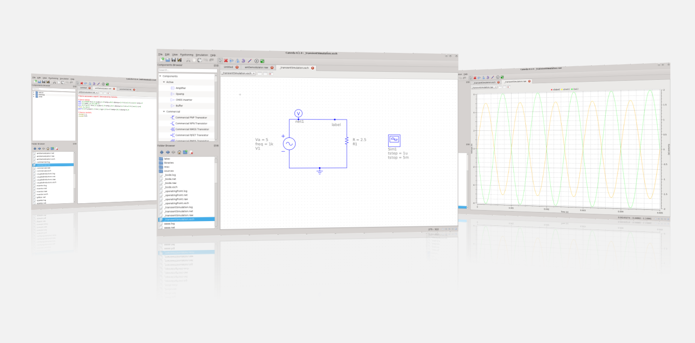

Caneda is an open source EDA software focused on easy of use and portability.

Caneda's goal is the complete design proccess from schematic capture, through
simulation and into circuit layout and PCB. 

While in the short term schematic capture and simulation is the primary goal, in the long term future, PCB and
layout edition will be covered. 

The software aims to support all kinds of circuit simulation types, e.g. DC, AC, S-parameter and harmonic balance analysis.

